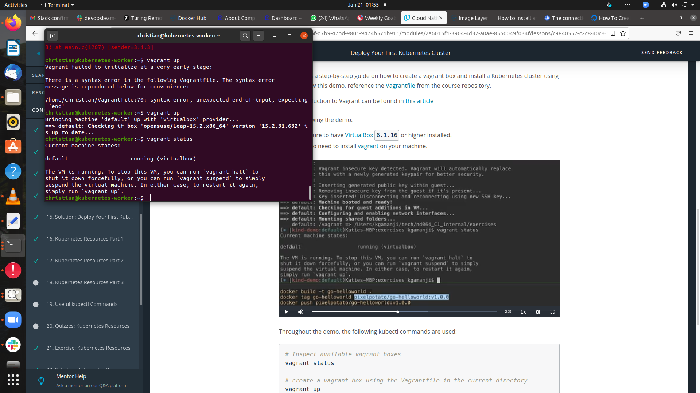
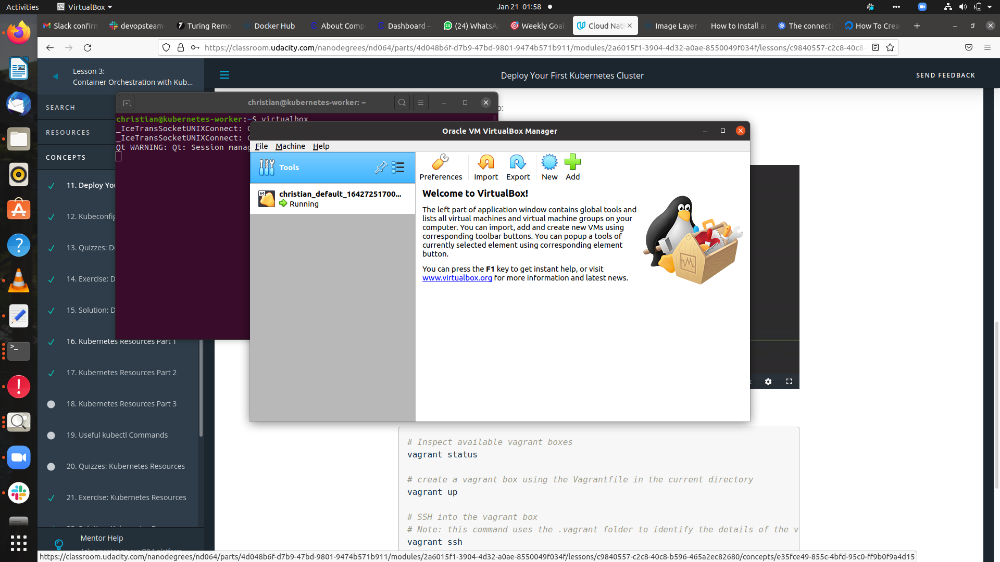
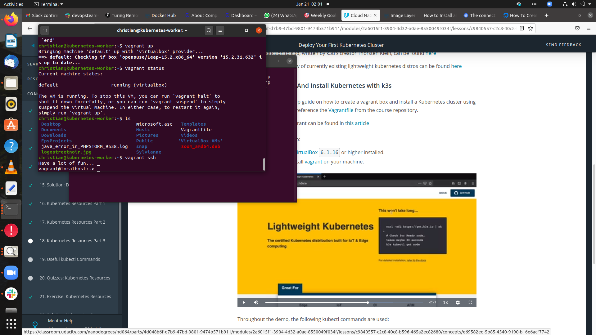
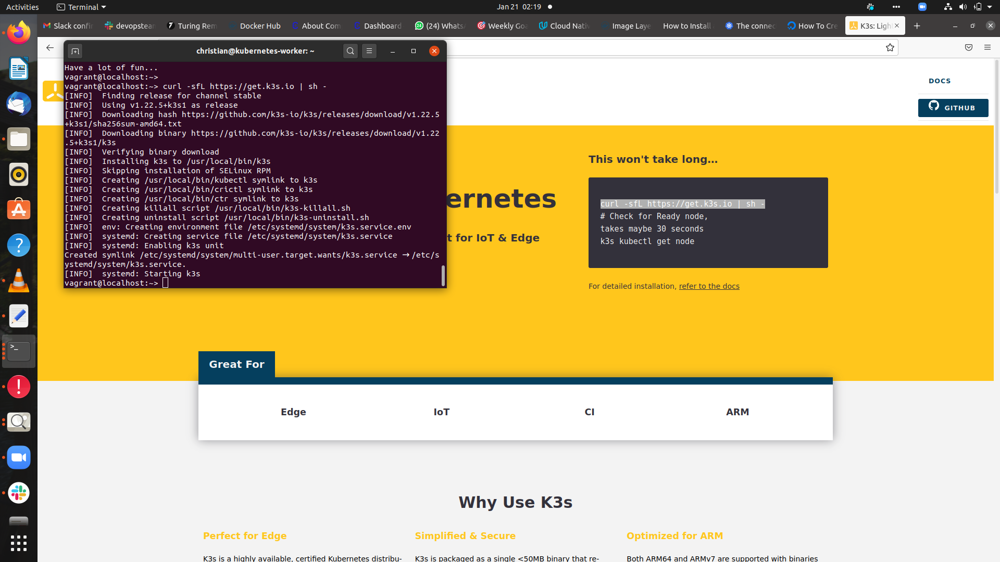
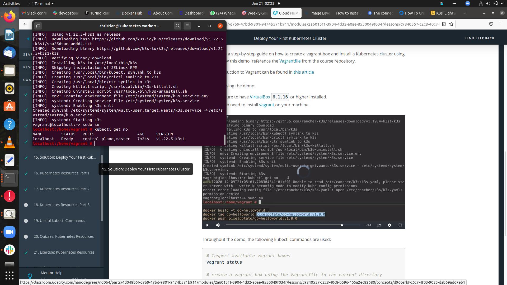
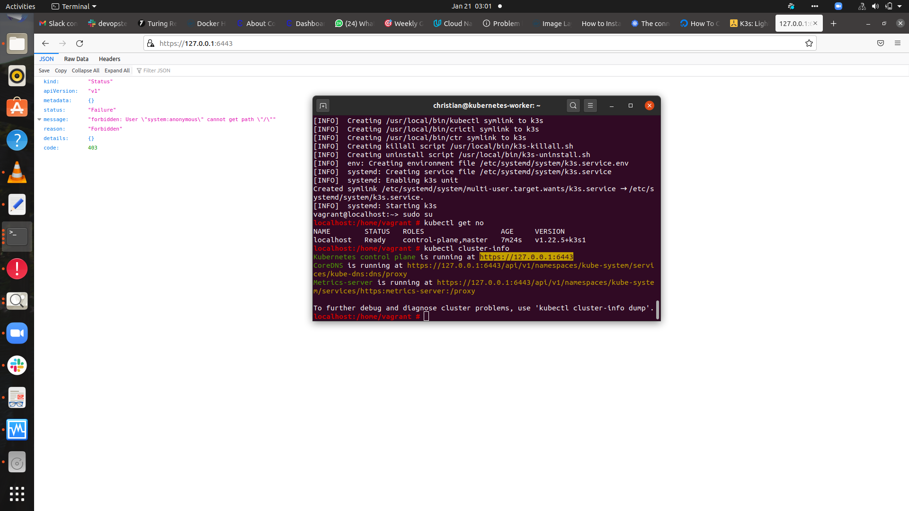
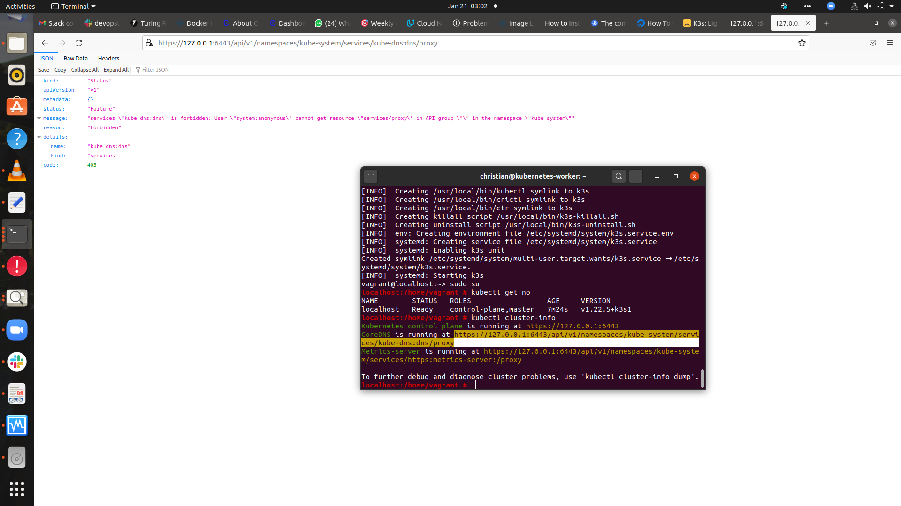
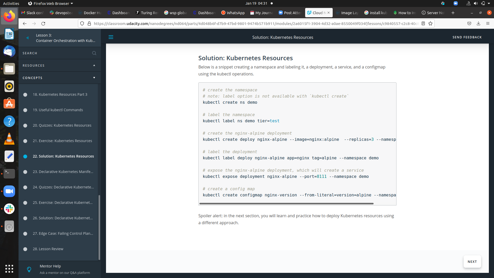

# Kubernetes clustering from k3s and deployment of the packaged application
Boostrapping a Kubernetes cluster with K3s and deploying the first Pod with declarative approach

# Introduction

We have traversed the packaging of an application using Docker and its distribution through DockerHub. The next phase in the release process is the deployment of the service. However, running an application in production implies that thousands and millions of customers might consume the product at the same time. 

It is paramount to build for scale. It is impossible to manually manage thousands of containers, keeping these are up to date with the latest code changes, in a healthy state, and accessible. As a result, a container orchestrator framework is necessary. 

A container orchestrator framework is capable to create, manage, configure thousands of containers on a set of distributed servers while preserving the connectivity and reachability of these containers. In the past years, multiple tools emerged within the landscape to provide these capabilities, including Docker Swarm, Apache Mesos, CoreOS Fleet, and many more. However, 
### Kubernetes 
took the lead in defining the principles of how to run containerized workloads on a distributed amount of machines. 

# Kubernetes Architecture

A Kubernetes cluster is composed of a collection of distributed physical or virtual servers. These are called nodes. Nodes are categorized into 2 main types: master and worker nodes. The components installed on a node, determine the functionality of a node, and identifies it as a master or worker node.

The suite of master nodes, represents the control plane, while the collection of worker nodes constructs the data plane.

A POD is the anatomic element within a cluster that provides the execution environment for an application. Pods are the smallest manageable units in a Kubernetes cluster. Every pod has a container within it, that executes an application from a Docker image (or any OCI-compliant image). 

# Install and start Vagrant

. Type 'Vagrant up' from the CLI to initialize the VagrantFile 
. Edit the VagrantFile by indicating the virtualbox repository and version, setting it to be 'opensuse/Leap-15.2.x86_64' and '15.2.31.632'

# Install and start VirtualBox 

# Connect to Vagrant with ssh 

# Bootstrap the Kubernetes cluster from K3s 
 . Type 'curl -sfL https://get.k3s.io | sh -' from the vagrant@localhost prompt
 
 
 . Switch to the vagrant superuser mode by typing 'sudo su' 
 . Launch the cluster by typing 'kubectl get no'
 
 
 # Viewing deployed cluster 
 
 
 
 # Kubernetes Reseources
 
 
 # Declarative approach in writing manifest files for deployment
 . Create and edit the manifest.yaml, deployment.yaml, service.yaml , namespace.yaml ... files
 . In vagrant super user mode , type 'kubectl apply -f manifest.yaml' or 'kubectl apply -f manifests/' ( creates a resource defined in the YAML manifests)
 . Inspect all the resources within the namespace , type ' kubectl get all -n demo  '
 
 
 
 
 

